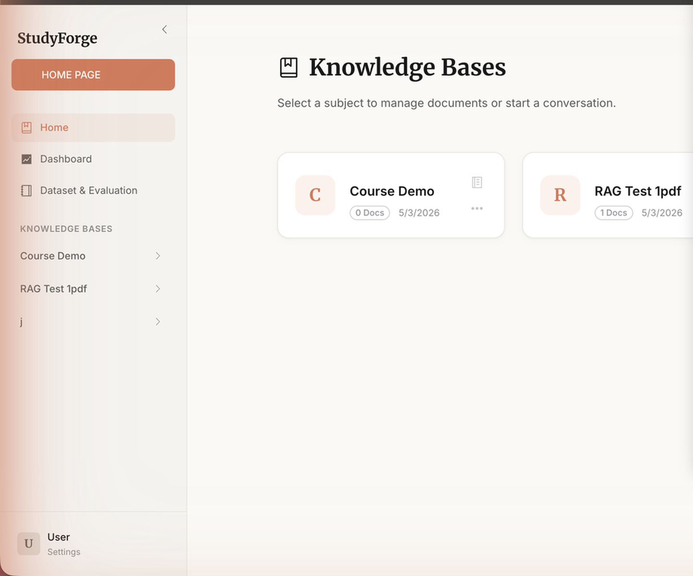
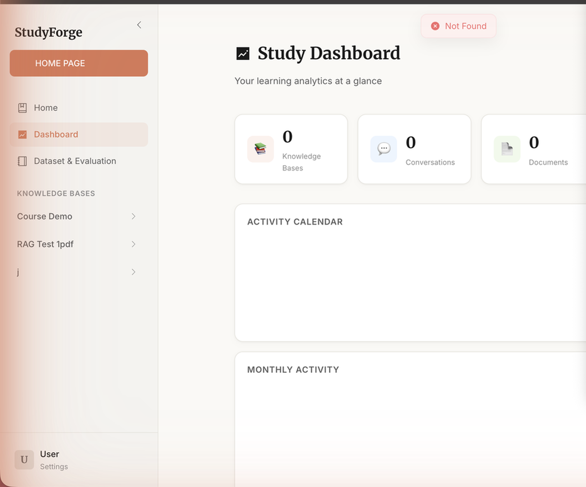
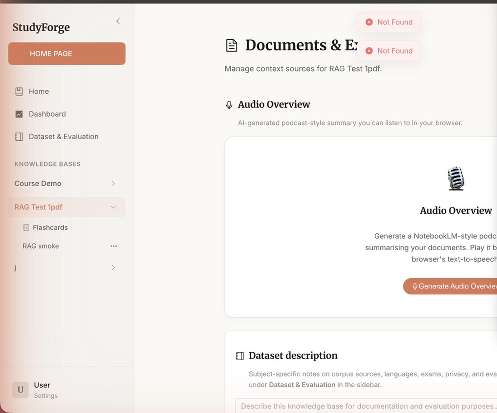
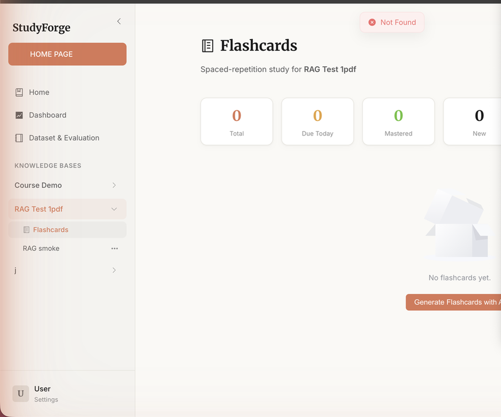
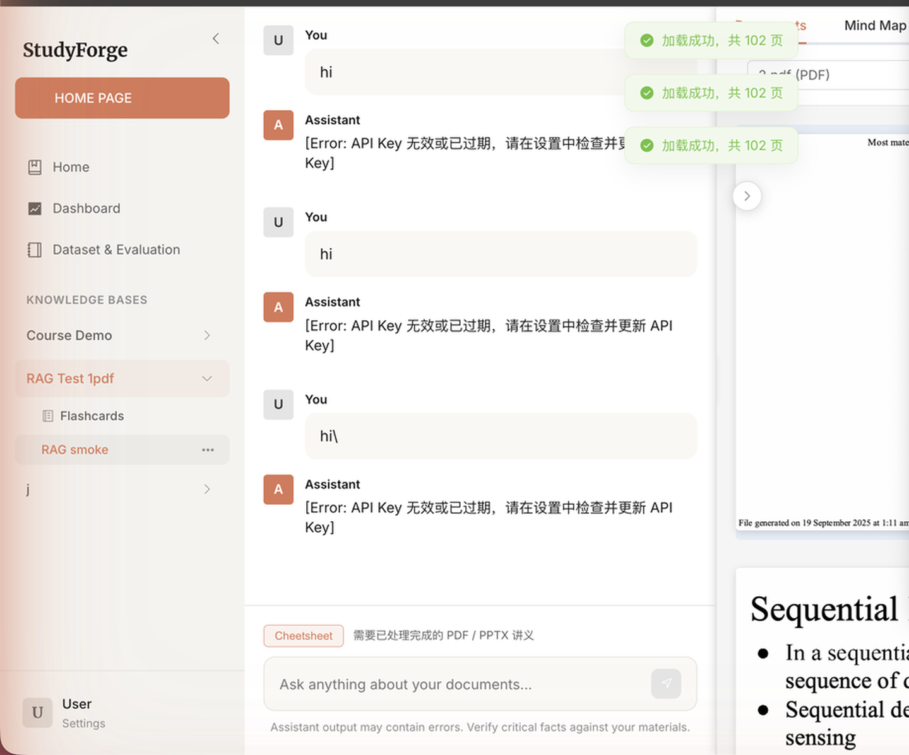

# StudyForge

**StudyForge** is an AI-powered study workspace that transforms your course materials into an interactive learning environment. Upload PDF and PPTX files, chat with your documents, generate flashcards, listen to AI-produced podcast summaries, and track your progress — all in one place.

---

## ✨ What's New

Three major features inspired by NotebookLM and modern study tools:

| Feature | Description |
|---|---|
| 🎙️ **Audio Overview** | AI generates a two-host podcast dialogue from your documents, playable via browser TTS |
| 🃏 **Flashcards + Spaced Repetition** | Auto-generate flashcards from your materials with SM-2 scheduling |
| 📊 **Study Dashboard** | Activity heatmap, monthly stats, and per-subject learning analytics |

---

## 📸 Screenshots

### Home — Knowledge Bases

Manage all your subjects from a clean card-grid dashboard.



---

### Study Dashboard

Track your daily learning streak, activity calendar, and flashcard progress with ECharts visualizations.



---

### Audio Overview

Generate a NotebookLM-style podcast dialogue from your uploaded documents and play it back directly in the browser using Web Speech API.



---

### Flashcards — Spaced Repetition

AI-generated flashcards with 3D flip animation and a five-grade SM-2 review system (Blackout → Easy).



---

### Chat with Documents

Ask questions grounded in your own PDFs and PPTX files. Answers are traceable to cited pages with an inline document preview panel.



---

## 🧠 Core Capabilities

- **Structured ingestion** — Upload course packs as PDF or PPTX (server-enforced limits).
- **Hybrid retrieval** — Vector + knowledge-graph modes (`naive`, `local`, `global`, `mix`) via LightRAG.
- **Traceable answers** — Citations tied back to rendered slides/pages.
- **Tool-assisted chat** — Optional function-calling path for documents, graphs, mind-maps, and paged reads.
- **Mind Map generation** — Automatic Markmap-rendered concept maps from your materials.
- **Exam analysis** — Upload past papers for structured question parsing and gap analysis.
- **Audio Overview** *(new)* — Podcast-style two-host dialogue script generated by LLM, playable via TTS.
- **Flashcards + SM-2** *(new)* — Generate up to 30 cards per subject, review with spaced-repetition scheduling.
- **Study Dashboard** *(new)* — Activity heatmap (GitHub-style), monthly bar chart, and flashcard progress ring.

---

## 🏗️ Architecture

```
Browser (Vue 3 + Pinia)
  └─► FastAPI (Python)
        ├─► LightRAG — extraction, KV + vector + graph stores
        ├─► Flashcard Service — SM-2 scheduling, JSON storage
        ├─► Audio Overview Service — LLM podcast script generation
        └─► Analytics Service — activity calendar, streak tracking
```

---

## ⚡ Quick Start

### Docker (recommended)

```bash
git clone https://github.com/arthurpanhku/studyforge.git
cd studyforge
docker compose up -d
```

| Endpoint | URL |
|---|---|
| Web UI | `http://localhost` |
| API docs | `http://localhost:8000/docs` |

Optional gateway key:

```bash
# .env
STUDYFORGE_API_KEY=your-shared-secret
```

### Docker (live-reload dev)

```bash
docker compose -f docker-compose.dev.yml up --build
```

| Endpoint | URL |
|---|---|
| Vite dev server | `http://localhost:5173` |
| API | `http://localhost:8000` |

### Native scripts

```bash
chmod +x start_all.sh stop_all.sh
./start_all.sh          # starts backend + frontend
./stop_all.sh           # stops both
```

Windows PowerShell equivalents: `start_all.ps1` / `stop_all.ps1`

Enable backend hot reload:

```bash
STUDYFORGE_RELOAD=1 ./start_all.sh
```

---

## 🔧 Requirements

| Context | Requirements |
|---|---|
| Docker | Docker Engine ≥ 20 / Docker Desktop |
| Native dev | Python ≥ 3.10, Node ≥ 16, npm |
| Optional | LibreOffice (crisp PPTX rendering) |

---

## ⚙️ Configuration

Settings are managed in-app via **User → Settings** or via environment variables / a `.env` file at the project root.

Key variables:

| Variable | Description |
|---|---|
| `LLM_BINDING_API_KEY` | API key for the default LLM provider |
| `LLM_BINDING_HOST` | Base URL for OpenAI-compatible API (e.g. DeepSeek) |
| `LLM_MODEL` | Model name (e.g. `deepseek-v4-pro`) |
| `STUDYFORGE_API_KEY` | Optional HTTP gateway key |

See `backend/.env.example` for the full list.

---

## 🗂️ New API Endpoints

| Method | Path | Description |
|---|---|---|
| `GET` | `/api/subjects/{id}/flashcards` | List all flashcards |
| `GET` | `/api/subjects/{id}/flashcards/due` | Due cards for today |
| `POST` | `/api/subjects/{id}/flashcards/generate` | Generate N cards with LLM |
| `POST` | `/api/subjects/{id}/flashcards/{card_id}/review` | Submit SM-2 review (quality 0–5) |
| `GET` | `/api/subjects/{id}/audio-overview` | Get generated podcast script |
| `POST` | `/api/subjects/{id}/audio-overview` | Generate podcast script |
| `GET` | `/api/analytics/global` | Global study stats |
| `GET` | `/api/analytics/subjects/{id}` | Per-subject analytics |

---

## 📁 Repository Layout

```
studyforge/
├── frontend/          # Vue 3 + Pinia + Element Plus
│   └── src/
│       ├── modules/
│       │   ├── flashcards/   # Flashcard view, store, service
│       │   ├── analytics/    # Dashboard view, analytics service
│       │   ├── audio/        # Audio Overview panel
│       │   ├── chat/         # Chat workspace
│       │   ├── documents/    # PPT/PDF viewer
│       │   ├── graph/        # Knowledge graph viewer
│       │   └── mindmap/      # Mind map viewer
│       └── layout/           # ClaudeLayout sidebar
├── backend/           # FastAPI + Python
│   └── app/
│       ├── api/       # REST route handlers
│       ├── services/  # Business logic (flashcard, analytics, audio, LightRAG…)
│       └── utils/     # PDF/PPTX parsers, image renderer
├── LightRAG/          # Vendored LightRAG (MIT)
├── docs/              # Dataset & evaluation guide
└── docker-compose.yml
```

---

## 📜 License

StudyForge application code is released under the **MIT License** (`LICENSE`).

The bundled **LightRAG** subtree ships under its own MIT license (`LightRAG/LICENSE`). Include both when redistributing.

---

## 🤝 Contributing

Issues and pull requests are welcome. Keep derivative documentation clearly attributed and respect upstream licenses when modifying vendored trees.

---

## 🔗 Links

- GitHub: [https://github.com/arthurpanhku/studyforge](https://github.com/arthurpanhku/studyforge)
- API Docs (local): [http://localhost:8000/docs](http://localhost:8000/docs)
